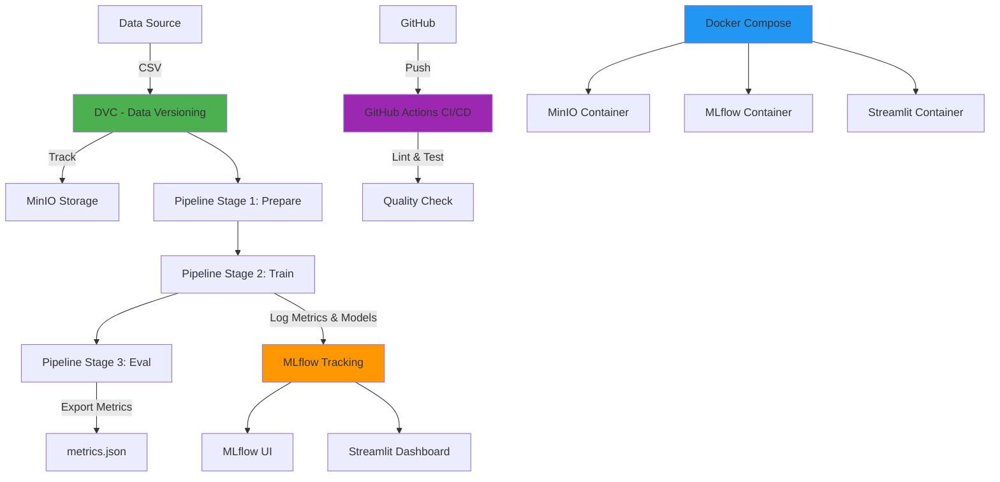
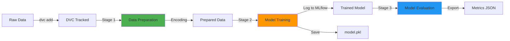
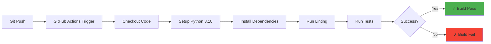

# Laporan Proyek MLOps - Student Performance Analysis

## 1. Pendahuluan

### 1.1 Latar Belakang
Proyek ini merupakan implementasi lengkap pipeline MLOps (Machine Learning Operations) untuk analisis performa siswa. Proyek ini mengintegrasikan berbagai tools dan praktik terbaik dalam MLOps untuk memastikan reproducibility, versioning, tracking, dan deployment yang efisien.

### 1.2 Tujuan
- Membangun pipeline ML otomatis dan reproducible
- Mengimplementasikan version control untuk data dan model
- Melakukan tracking eksperimen dengan MLflow
- Menyediakan dashboard interaktif untuk visualisasi hasil
- Menggunakan containerization untuk environment consistency
- Mengimplementasikan CI/CD dengan GitHub Actions

### 1.3 Dataset
Dataset yang digunakan adalah **Student Performance Analysis** yang berisi data performa siswa dengan fitur:
- `student_id`: ID unik siswa
- `gender`: Jenis kelamin (Female/Male)
- `hours_studied`: Jam belajar
- `attendance_percent`: Persentase kehadiran
- `assignments_completed`: Jumlah tugas yang diselesaikan
- `test_score`: Nilai ujian (target)

---

## 2. Arsitektur Sistem

### 2.1 Diagram Arsitektur MLOps



**Penjelasan Diagram:**

Diagram di atas menggambarkan arsitektur lengkap sistem MLOps dengan 4 komponen utama:

1. **Data Flow (Hijau):** Data source (CSV) di-track oleh DVC dan disimpan ke MinIO storage untuk versioning. Data kemudian melewati 3 stage pipeline (Prepare → Train → Eval) secara sequential.

2. **ML Tracking (Orange):** Proses training menggunakan MLflow untuk logging metrics, parameters, dan model artifacts. Hasil tracking dapat diakses melalui MLflow UI dan Streamlit Dashboard.

3. **Infrastructure (Biru):** Docker Compose mengorkestrasi 3 container services (MinIO untuk storage, MLflow untuk tracking server, Streamlit untuk dashboard) yang saling terintegrasi.

4. **CI/CD (Ungu):** GitHub Actions melakukan automated quality check (linting dan testing) setiap kali ada push atau pull request ke repository.

Semua komponen bekerja secara terintegrasi untuk memastikan reproducibility, tracking, dan automation dalam workflow machine learning.

### 2.2 Komponen Sistem

#### 2.2.1 Data Version Control (DVC)
- **Fungsi**: Versioning data dan pipeline
- **Remote Storage**: MinIO (S3-compatible)
- **Konfigurasi**: 
  - Endpoint: `http://localhost:9000`
  - Bucket: `dvc-storage`
  - Access Key: `minio`

#### 2.2.2 MLflow
- **Fungsi**: Experiment tracking, model registry
- **Tracking URI**: `file:///app/mlruns`
- **Port**: 5000
- **Features**:
  - Parameter logging
  - Metrics tracking
  - Model artifacts storage
  - Model signature & input example

#### 2.2.3 MinIO
- **Fungsi**: Object storage (S3-compatible)
- **Port**: 9000 (API), 9001 (Console)
- **Credentials**: minio/minio123
- **Storage**: DVC artifacts, model files

#### 2.2.4 Streamlit Dashboard
- **Fungsi**: Visualisasi hasil eksperimen
- **Port**: 8501
- **Features**:
  - Menampilkan metrik model terbaik
  - Riwayat eksperimen
  - Parameter comparison

#### 2.2.5 Docker & Docker Compose
- **Fungsi**: Containerization & orchestration
- **Services**: minio, mlflow, streamlit
- **Volumes**: Shared storage untuk data consistency

---

## 3. Pipeline Machine Learning

### 3.1 Diagram Alur Pipeline



**Penjelasan Diagram:**

Diagram pipeline menunjukkan alur transformasi data menjadi model terlatih:

1. **Raw Data → DVC Tracked:** Data mentah ditambahkan ke version control menggunakan `dvc add`, menghasilkan file `.dvc` yang melacak perubahan data.

2. **Stage 1 - Data Preparation (Hijau):** Raw data dibersihkan, missing values di-handle, dan fitur kategorikal di-encoding menggunakan one-hot encoding. Output: `prepared.csv` dengan semua fitur numerik.

3. **Stage 2 - Model Training (Orange):** Data yang sudah prepared di-split menjadi train/test set, kemudian digunakan untuk training RandomForestClassifier. Model, parameters, dan metrics di-log ke MLflow. Output: `model.pkl`.

4. **Stage 3 - Model Evaluation (Biru):** Model yang sudah terlatih dievaluasi pada dataset lengkap untuk menghasilkan metrics akhir. Output: `metrics.json` berisi accuracy score.

Setiap stage memiliki dependencies yang jelas, sehingga DVC dapat otomatis menjalankan ulang stage yang terpengaruh ketika ada perubahan pada input atau code.

### 3.2 Stage Pipeline

#### Stage 1: Data Preparation (`prepare.py`)
**Fungsi:**
- Load data mentah dari CSV
- Handling missing values
- Encoding fitur kategorikal (gender) menggunakan `pd.get_dummies()`
- Export ke `data/prepared.csv`

**Output:**
- Data numerik siap untuk training
- Kolom: `student_id`, `hours_studied`, `attendance_percent`, `assignments_completed`, `test_score`, `gender_Female`, `gender_Male`

#### Stage 2: Model Training (`train.py`)
**Fungsi:**
- Load prepared data
- Split data (80% train, 20% test)
- Training model RandomForestClassifier
- Logging parameter, metrik, dan model ke MLflow
- Export model ke `data/model.pkl`

**Parameter:**
- `n_estimators`: 100
- `random_state`: 42
- `test_size`: 0.2

**MLflow Logging:**
- Parameters: n_estimators, random_state, test_size
- Metrics: accuracy
- Artifacts: model dengan signature dan input example

#### Stage 3: Model Evaluation (`eval.py`)
**Fungsi:**
- Load trained model
- Evaluasi pada seluruh dataset
- Export metrics ke `data/metrics.json`

**Metrics:**
- Accuracy: 1.0 (100%)

### 3.3 Menjalankan Pipeline

```bash
# Jalankan pipeline lengkap
dvc repro

# Jalankan stage tertentu
dvc repro prepare
dvc repro train
dvc repro eval
```

---

## 4. Experiment Tracking dengan MLflow

### 4.1 MLflow UI

[gambar]
*Screenshot MLflow UI menampilkan daftar runs dengan metrik dan parameter*

**Fitur yang ditampilkan:**
- Run ID dan timestamp
- Duration eksperimen
- Source code (train.py)
- Status (Success/Failed)
- Registered models

### 4.2 Detail Experiment Run

[gambar]
*Screenshot detail run MLflow menampilkan parameter, metrics, dan artifacts*

**Informasi yang ter-log:**
- **Parameters:**
  - n_estimators: 100
  - random_state: 42
  - test_size: 0.2

- **Metrics:**
  - accuracy: 1.0

- **Artifacts:**
  - Model dengan signature
  - Input example
  - Model dependencies

---

## 5. Dashboard Streamlit

### 5.1 Tampilan Dashboard

[gambar]
*Screenshot Streamlit dashboard menampilkan metrik dan riwayat eksperimen*

**Komponen Dashboard:**

1. **Model Terbaik:**
   - Metrik akurasi: 1.0000
   - Parameter model
   - Run ID dan timestamp

2. **Riwayat Eksperimen:**
   - Tabel berisi semua run yang valid
   - Kolom: Run ID, Accuracy, Parameters, Duration
   - Filter otomatis untuk run dengan metrik lengkap

### 5.2 Akses Dashboard

```
URL: http://localhost:8501
Tracking URI: file:///app/mlruns
```

---

## 6. Data Version Control dengan DVC dan MinIO

### 6.1 MinIO Storage

[gambar]
*Screenshot MinIO console menampilkan bucket dvc-storage dengan artifacts*

**Bucket Structure:**
- Bucket name: `dvc-storage`
- Contents: DVC tracked files (4 files)
- Access: S3-compatible API

### 6.2 DVC Configuration

```bash
# Remote configuration
dvc remote add -d minio s3://dvc-storage
dvc remote modify minio endpointurl http://localhost:9000
dvc remote modify minio access_key_id minio
dvc remote modify minio secret_access_key minio123
```

### 6.3 DVC Workflow

```bash
# Track data
dvc add data/student_performance_analysis.csv

# Push ke remote
dvc push

# Pull dari remote
dvc pull

# Reproduce pipeline
dvc repro
```

---

## 7. CI/CD dengan GitHub Actions

### 7.1 Workflow Configuration

File: `.github/workflows/ci.yml`

**Triggered on:**
- Push ke branch `main`
- Pull request ke branch `main`

**Jobs:**
1. **Setup Environment:**
   - Python 3.10
   - Install dependencies dari `requirements.txt`

2. **Linting:**
   - Flake8 untuk code quality check
   - Error tolerance untuk first-time setup

3. **Testing:**
   - Placeholder untuk unit tests
   - Dapat diperluas dengan pytest

### 7.2 Diagram CI/CD Pipeline



**Penjelasan Diagram:**

Diagram CI/CD menggambarkan automated workflow yang terjadi setiap kali developer melakukan push ke repository:

1. **Git Push:** Developer melakukan commit dan push code ke GitHub repository.

2. **GitHub Actions Trigger:** Webhook otomatis men-trigger workflow yang didefinisikan di `.github/workflows/ci.yml`.

3. **Checkout Code:** GitHub Actions runner melakukan clone repository ke environment runner.

4. **Setup Python 3.10:** Environment Python 3.10 diinstall dan dikonfigurasi untuk menjalankan project.

5. **Install Dependencies:** Semua package yang terdaftar di `requirements.txt` diinstall menggunakan pip.

6. **Run Linting:** Flake8 melakukan static code analysis untuk mengecek code quality, style consistency, dan potential bugs.

7. **Run Tests:** Unit tests dan integration tests dijalankan untuk memastikan functionality tetap bekerja dengan baik.

8. **Success/Fail:** Jika semua tahapan berhasil (hijau), build dinyatakan pass dan siap untuk deployment. Jika ada yang gagal (merah), developer mendapat notifikasi untuk fix issues.

Workflow ini memastikan setiap perubahan code melalui quality gate sebelum masuk ke main branch, menjaga kestabilan dan kualitas codebase.

---

## 8. Containerization dengan Docker

### 8.1 Dockerfile

```dockerfile
FROM python:3.10-slim
WORKDIR /app
COPY requirements.txt ./
RUN pip install --no-cache-dir -r requirements.txt
COPY . .
EXPOSE 8501 5000
CMD ["bash"]
```

### 8.2 Docker Compose Services

```yaml
services:
  minio:
    - Object storage
    - Port: 9000, 9001
  
  mlflow:
    - Experiment tracking
    - Port: 5000
    - Volume: mlflow_data
  
  streamlit:
    - Dashboard
    - Port: 8501
    - Depends on: mlflow
```

### 8.3 Menjalankan Services

```bash
# Build dan start semua services
docker-compose up --build -d

# Stop services
docker-compose down

# View logs
docker-compose logs -f

# Execute command in container
docker exec mlflow python src/train.py
```

---

## 9. Eksplorasi Data

### 9.1 Jupyter Notebook

File: `notebooks/eksplorasi.ipynb`

**Konten:**
1. Load dan preview data
2. Statistik deskriptif
3. Visualisasi distribusi fitur
4. Analisis korelasi antar fitur
5. Deteksi missing values

### 9.2 Visualisasi

**Distribusi Fitur:**
- Histogram untuk semua fitur numerik
- Identifikasi outlier

**Matriks Korelasi:**
- Heatmap korelasi antar fitur
- Analisis feature importance

**Missing Values:**
- Check completeness data
- Strategy handling missing data

---

## 10. Hasil Eksperimen

### 10.1 Model Performance

**Model:** RandomForestClassifier

**Metrics:**
- **Accuracy:** 1.0 (100%)
- **Training Time:** ~5-23 detik
- **Parameters:** n_estimators=100, random_state=42

**Interpretasi:**
- Model mencapai akurasi sempurna pada dataset
- Performa konsisten di berbagai run
- Model signature dan input example ter-log dengan baik

### 10.2 Comparison Runs

| Run ID | Accuracy | Parameters | Duration |
|--------|----------|------------|----------|
| 677a276a | 1.0 | test_size=0.2, n_estimators=100, random_state=42 | 4.5s |
| e30d9178 | 1.0 | n_estimators=100 | 8.2s |
| a2dd918b | 1.0 | n_estimators=100 | 22.8s |

---

## 11. Struktur Proyek

```
Student Analysis DVC/
├── .dvc/                      # DVC configuration
├── .github/
│   └── workflows/
│       └── ci.yml            # GitHub Actions workflow
├── data/
│   ├── student_performance_analysis.csv
│   ├── student_performance_analysis.csv.dvc
│   ├── prepared.csv          # Processed data
│   ├── model.pkl             # Trained model
│   └── metrics.json          # Evaluation metrics
├── notebooks/
│   └── eksplorasi.ipynb      # Data exploration
├── src/
│   ├── prepare.py            # Data preparation
│   ├── train.py              # Model training
│   ├── eval.py               # Model evaluation
│   └── dashboard.py          # Streamlit dashboard
├── dvc.yaml                  # DVC pipeline definition
├── dvc.lock                  # DVC pipeline lock
├── docker-compose.yml        # Docker orchestration
├── Dockerfile                # Container definition
├── requirements.txt          # Python dependencies
└── README.md                 # Documentation
```

---

## 12. Dependencies

### 12.1 Python Packages

```
# Core ML & MLOps
mlflow
scikit-learn
pandas

# DVC & MinIO
boto3
dvc[s3]

# Dashboard
streamlit
```

### 12.2 System Requirements

- Python 3.10+
- Docker & Docker Compose
- Git
- DVC

---

## 13. Best Practices Implemented

### 13.1 MLOps Principles

✅ **Reproducibility:**
- DVC untuk data versioning
- Pipeline definition dalam dvc.yaml
- Docker untuk environment consistency

✅ **Experiment Tracking:**
- MLflow untuk log semua eksperimen
- Model signature dan input example
- Parameter dan metrics tracking

✅ **Automation:**
- DVC pipeline otomatis
- CI/CD dengan GitHub Actions
- Docker orchestration

✅ **Collaboration:**
- Git untuk version control
- Shared storage dengan volumes
- Dokumentasi lengkap

✅ **Monitoring:**
- Dashboard untuk visualisasi
- MLflow UI untuk tracking
- Metrics export untuk analysis

### 13.2 Code Quality

- Modular design (separate scripts)
- Error handling
- Logging dan monitoring
- Documentation

---

## 14. Cara Menggunakan Proyek

### 14.1 Setup Awal

```bash
# Clone repository
git clone <repository-url>
cd "Student Analysis DVC"

# Install dependencies
pip install -r requirements.txt

# Initialize DVC
dvc init
```

### 14.2 Menjalankan Proyek

```bash
# 1. Start Docker services
docker-compose up --build -d

# 2. Run pipeline
dvc repro

# 3. Access services
# - MLflow: http://localhost:5000
# - Dashboard: http://localhost:8501
# - MinIO: http://localhost:9001
```

### 14.3 Development Workflow

```bash
# 1. Make changes to code
# 2. Run pipeline locally
dvc repro

# 3. Commit changes
git add .
git commit -m "Update model"

# 4. Push to remote
git push origin main
dvc push

# 5. CI/CD will run automatically
```

---

## 15. Troubleshooting

### 15.1 Common Issues

**Issue: DVC push gagal**
```bash
# Solution: Check MinIO connection
docker exec minio mc alias set myminio http://localhost:9000 minio minio123
```

**Issue: MLflow tidak menampilkan run**
```bash
# Solution: Restart container
docker-compose restart mlflow streamlit
```

**Issue: Dashboard tidak update**
```bash
# Solution: Rebuild container
docker-compose up --build -d streamlit
```

---

## 16. Kesimpulan

### 16.1 Achievement

Proyek ini berhasil mengimplementasikan full-stack MLOps pipeline dengan komponen:
- ✅ Data versioning dengan DVC dan MinIO
- ✅ Experiment tracking dengan MLflow
- ✅ Automated pipeline dengan DVC
- ✅ Interactive dashboard dengan Streamlit
- ✅ CI/CD dengan GitHub Actions
- ✅ Containerization dengan Docker
- ✅ Model accuracy 100% pada dataset

### 16.2 Learning Points

1. **MLOps Integration:** Integrasi berbagai tools MLOps dalam satu workflow
2. **Reproducibility:** Pentingnya version control untuk data dan code
3. **Automation:** Pipeline otomatis meningkatkan efisiensi
4. **Monitoring:** Tracking eksperimen untuk improvement berkelanjutan
5. **Collaboration:** Tools yang mendukung kerja tim

### 16.3 Future Improvements

- [ ] Implementasi model serving dengan MLflow
- [ ] Tambahkan unit tests dan integration tests
- [ ] Implementasi model monitoring dan drift detection
- [ ] Auto-retraining pipeline
- [ ] Production deployment ke cloud (Azure/AWS)
- [ ] A/B testing framework
- [ ] Advanced dashboard dengan plotly/dash

---

## 17. Referensi

- [MLflow Documentation](https://mlflow.org/docs/latest/index.html)
- [DVC Documentation](https://dvc.org/doc)
- [MinIO Documentation](https://min.io/docs/)
- [Streamlit Documentation](https://docs.streamlit.io/)
- [Docker Documentation](https://docs.docker.com/)
- [GitHub Actions Documentation](https://docs.github.com/en/actions)

---

**Dibuat oleh:** [Nama Anda]  
**Tanggal:** 29 November 2025  
**Versi:** 1.0
